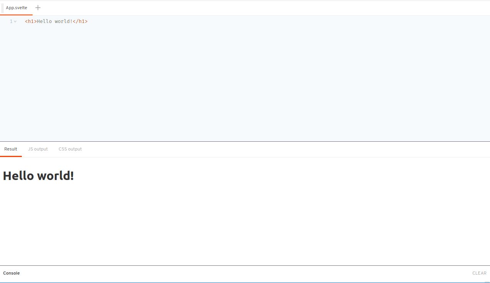
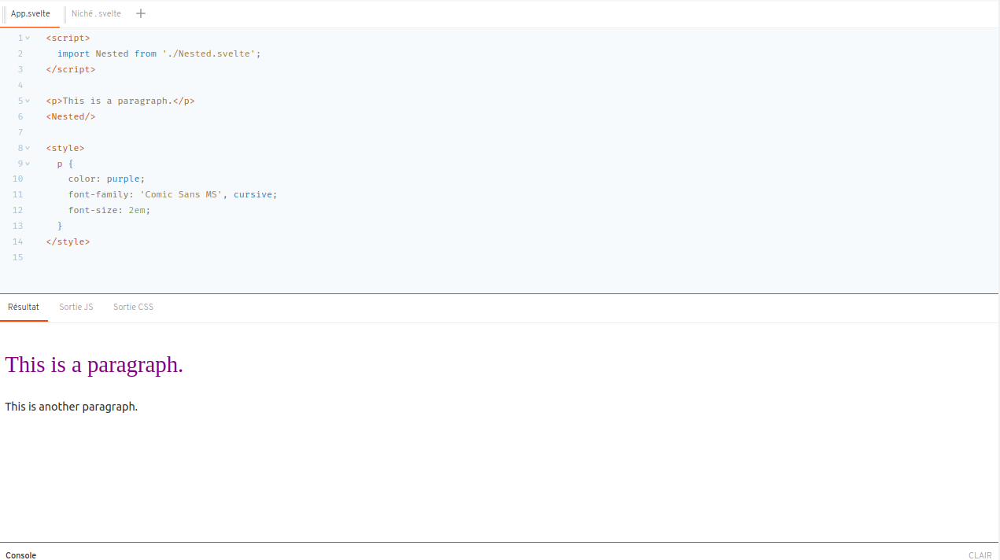
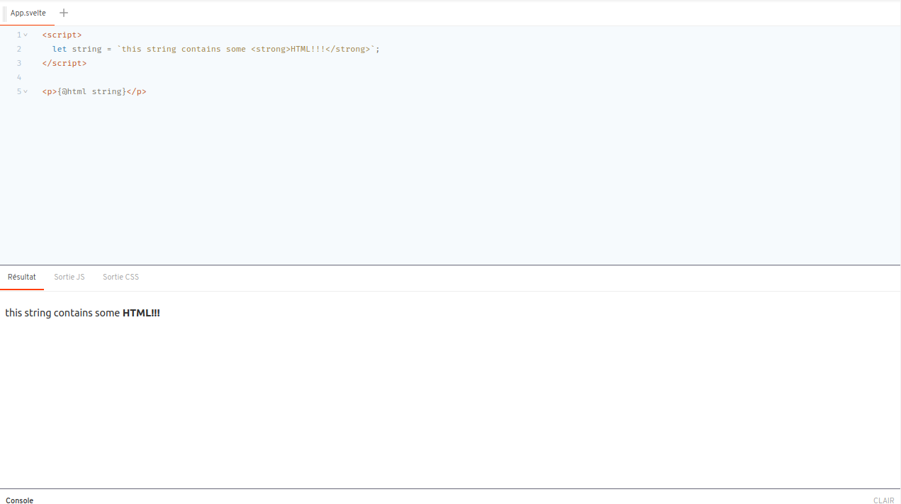
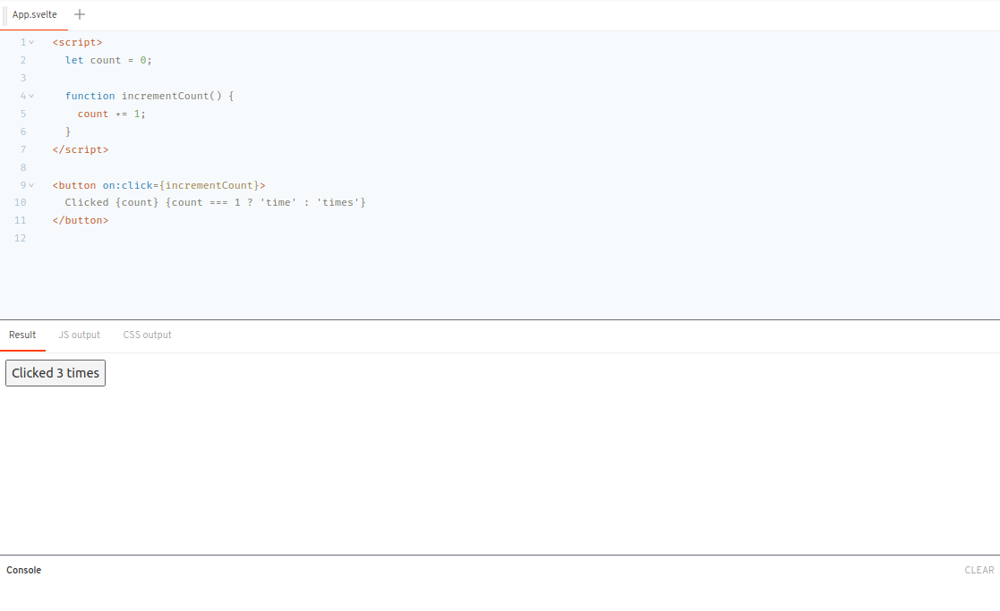
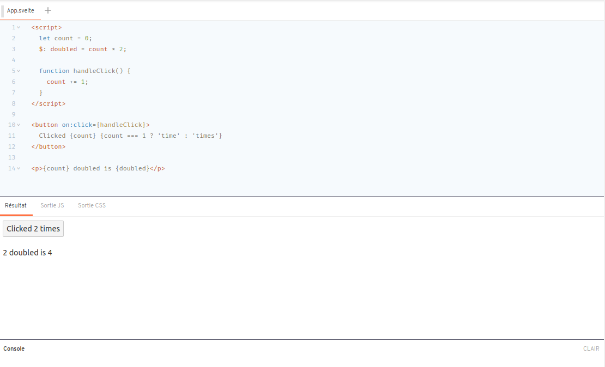
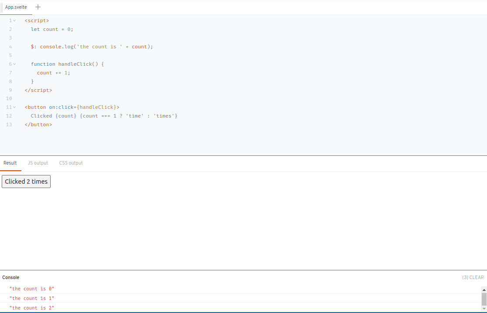
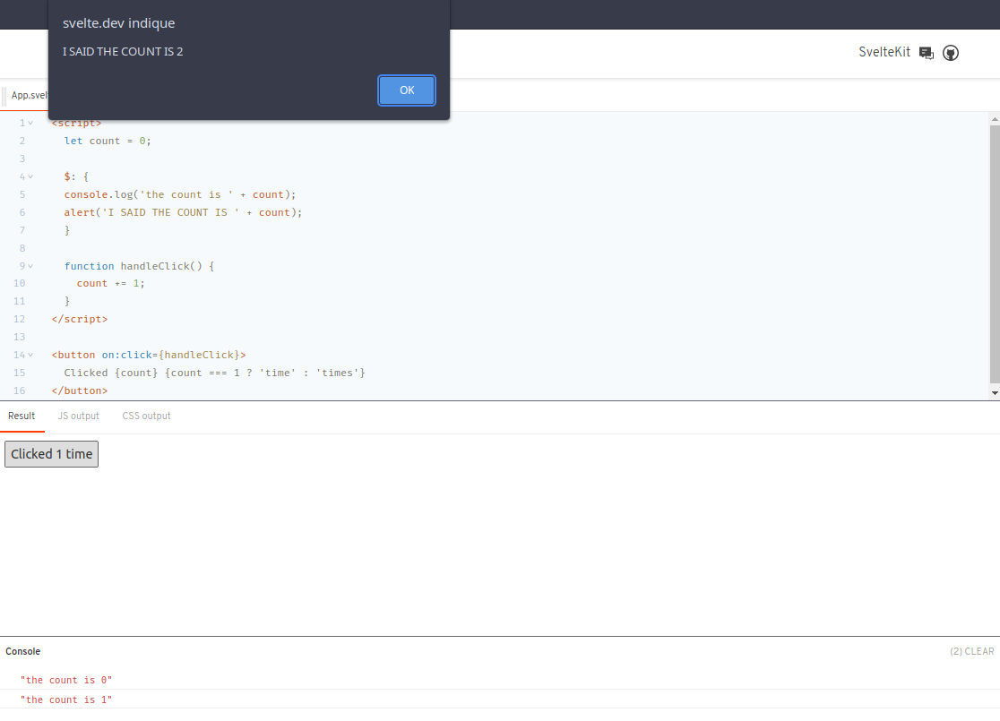
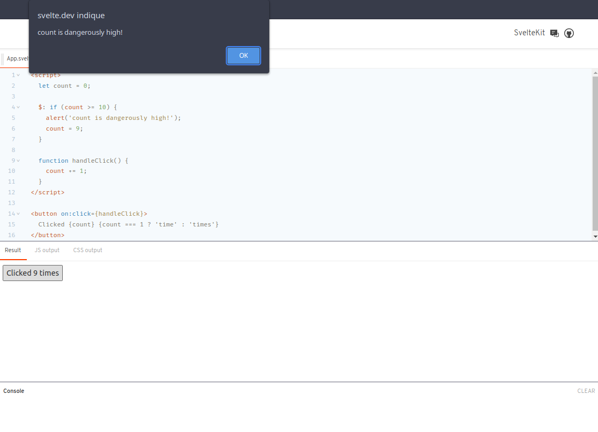
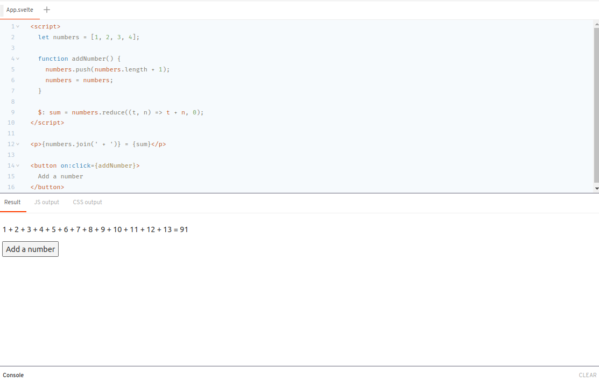

# C'est quoi Svelte ?

Svelte est un outil permettant de créer des applications Web rapides. Il est similaire aux frameworks JavaScript tels que React et Vue, qui partagent l'objectif de faciliter la création d'interfaces utilisateur interactives fluides.

Mais il y a une différence cruciale: Svelte convertit votre application en JavaScript idéal au moment de la construction, plutôt que d'interpréter le code de votre application au moment de l'exécution. Cela signifie que vous ne payez pas le coût de performance des abstractions du framework et que vous n'encourez pas de pénalité lors du premier chargement de votre application. 

Vous pouvez créer l'intégralité de votre application avec Svelte, ou vous pouvez l'ajouter progressivement à une base de code existante. Vous pouvez également expédier des composants sous forme de packages autonomes qui fonctionnent n'importe où, sans les frais généraux d'une dépendance à un framework conventionnel.

## Comprendre les composants

Dans Svelte, une application est composée d'un ou plusieurs *composants*. Un composant est un bloc de code autonome réutilisable qui encapsule HTML, CSS et JavaScript qui vont ensemble, écrits dans un fichier `.svelte`.

***L'exemple 'Hello world' dans l'éditeur de code est un composant simple :*** 



## Composants imbriquées

***Fichier*** `App.svelte` :
```html
<p>This is a paragraph.</p>

<style>
	p {
		color: purple;
		font-family: 'Comic Sans MS', cursive;
		font-size: 2em;
	}
</style>
```
Il ne serait pas pratique de mettre toute votre application dans un seul composant. Au lieu de cela, nous pouvons importer des composants à partir d'autres fichiers, puis les utiliser comme si nous incluions des éléments.

Ajoutons une balise `<script>` au fichier `App.svelte`, qui importe le fichier (notre composant) `Nested.svelte` dans notre application ...

***Fichier*** `Nested.svelte` ***(sur le screenshot il est dénommé*** `Niché.svelte` ***c'est à cause de google traduction) :***
```html
<p>This is another paragraph.</p>
```
... puis utilisez le composant `Nested` dans le balisage de l'application :



Notez également que le nom du composant `Nested` est en majuscule. Cette convention a été adoptée pour nous permettre de faire la différence entre les composants définis par l'utilisateur et les balises HTML standard.

## Balise HTML

Dans Svelte, on peut se passer des `<` et `>` et rendre de l'HTML directement dans un composant. On fait cela avec la balise spéciale `{@html ... }`

***Code de base (sans la balise) :***
```html
<script>
	let string = `this string contains some <strong>HTML!!!</strong>`;
</script>

<p>{string}</p>
```

***Code avec utilisation de la balise*** `{@html ...}` :



## Faire une application

Tout d'abord, vous devrez intégrer Svelte à un outil de construction. Nous vous recommandons d'utiliser [SvelteKit](https://kit.svelte.dev/) , qui configure [Vite](https://vitejs.dev/) avec [vite-plugin-svelte](https://github.com/sveltejs/vite-plugin-svelte/) pour vous...

```bash
npm create svelte@latest myapp
```
[Guide étape par étape pour utiliser l'outil.](https://svelte.dev/blog/svelte-for-new-developers)

***Pour configurer votre éditeur de texte avec l'extension officielle de Svelte pour VS Code, executer la commande :***
```bash
ext install svelte.svelte-vscode
```

# Réactivité

## DOM et application

Svelte possède un puissant sytème de *réactivité*, qui lui permet de synchroniser le DOM avec l'application.

***Code de base :***
```bash
<script>
	let count = 0;

	function incrementCount() {
		// event handler code goes here
	}
</script>

<button>
	Clicked {count} {count === 1 ? 'time' : 'times'}
</button>
```

On connecte un gestionnaire d'événements.

```bash
<button on:click={incrementCount}>
```

A l'intérieur de la fonction `incrementCount`, il suffit de changer la valeur de `count` :

```bash
function incrementCount() {
	count += 1;
}
```

***Resultat :***



Svelte "instrumente" cette affectation avec du code qui lui indique que le DOM devra être mis à jour.

## Déclaration réactives

 En plus de synchro le DOM aux variables, Svelte permet aussi de synchroniser les variables les unes avec les autres à l'aide de déclarations réactives.

 ***Code de base :***

 ```bash
 <script>
	let count = 0;

	function handleClick() {
		count += 1;
	}
</script>

<button on:click={handleClick}>
	Clicked {count} {count === 1 ? 'time' : 'times'}
</button>
```

La déclaration réactive ici est écrite dans un JavaScript non-conventionnelle, mais fonctionnelle et que Svlete comprend :

```bash
let count = 0;
$: doubled = count * 2;
```

Utilisons `doubled` dans notre balisage :

```bash
<p>{count} doubled is {doubled}</p>
```

***Resultat :***



*Dans le `<p>` on aurait pu écrire `{count*2}`, à la place de `{doubled}`, et sans passer par le balisage avec le `$:` qui est dans le `<script>`, le resultat aurait été le même. Seulement les valeurs réactives sont très utiles pour référencer plusieurs fois une valeur ou que vous avez des valeurs qui dépendent d'autres valeurs réactives.*

## Instructions arbitraire réactive 

Nous ne sommes pas limités à déclarer des valeurs réactives, nous pouvons également exécuter des instructions arbitraires de manière réactive.

***Code de base :***
```bash
<script>
	let count = 0;

	function incrementCount() {
		// event handler code goes here
	}
</script>

<button>
	Clicked {count} {count === 1 ? 'time' : 'times'}
</button>
```

On enregistre la valeur de `count` chaque fois qu'elle change.

```bash
$: console.log('the count is ' + count);
```


On regroupe les instructions dans un bloc.

```bash
$: {
	console.log('the count is ' + count);
	alert('I SAID THE COUNT IS ' + count);
}
```


On peut même mettre le `$:` devant des blocs comme `if` :



## Mettre à jour des tableaux et des objets

Afin de pouvoir mettre à jour une méthode, il va falloir s'attribuer une valeur à elle même pour indiquer au compilateur que celle-ci a changé. Sans ça, la méthode qui s'occupe pour modifié un tableau ou un objet, ne mettra pas à jour les nouvelles valeurs qui ont changé.

***Code de base***

```bash
<script>
	let numbers = [1, 2, 3, 4];

	function addNumber() {
		numbers.push(numbers.length + 1);
	}

	$: sum = numbers.reduce((t, n) => t + n, 0);
</script>

<p>{numbers.join(' + ')} = {sum}</p>

<button on:click={addNumber}>
	Add a number
</button>
```
*Dans le code ci-dessus, le boutton qui appelle la fonction `addNumber`, ajoute une valeur au tableau, mais en revanche elle ne déclenche pas le recalcul de `sum`.*

Alors on attribue la valeur `numbers` à elle même pour indiquer au compilateur que celle-ci a changé. Ici, plusieurs manière d'ecrire sont possible (le resultat restera le même.).

**Syntaxe normale**<br>

```bash
function addNumber() {
	numbers.push(numbers.length + 1);
	numbers = numbers;
}
```
*ou*<br>

**Syntaxe ES6**

```bash
function addNumber() {
	numbers = [...numbers, numbers.length + 1];
}
```

***Resultat (syntaxe normale) :***



Il faut que l'affectation soit faite **directement** à la référence.<br> 
Si celle-ci est faite **indirectement**, alors cela ne fonctionnera pas. Il faudra faire comme dans le resultats ci-dessus, c'est à dire s'attribuer une valeur à elle même.<br>
Une règle empirique et simple : la variable mise à jour doit apparaître directement sur le côté gauche de l'affectation.


---

**NB**: *Beaucoup de copier/coller depuis le site officiel car c'est très bien expliqué et facile à comprendre. J'ai synthétiser pour aller à l'essentiel donc ce support n'est pas recommander pour quelqu'un qui n'a pas/trop peu de connaisssance en la matière.*

*Source : https://svelte.dev/tutorial/basics*

---